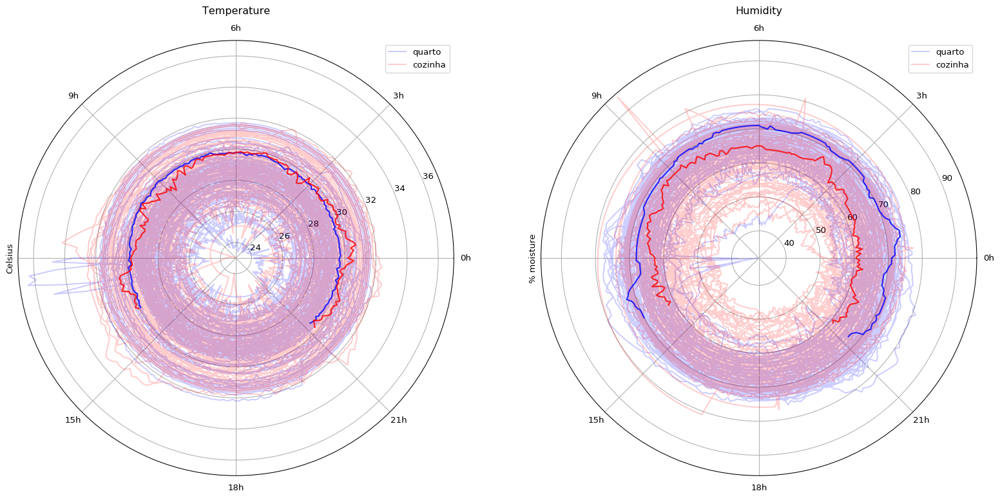

# smarthome
IoT system for home monitoring

This is the temperature and humidity in the kitchen and in the bedroom. The latest 100 readings are highlighted.

Device located in the bedroom

Device located in the kitchen

As seen, we had to extend the connection between the DHT-11 module and the ESP8266 because the heat from the ESP was affecting temperature readings.